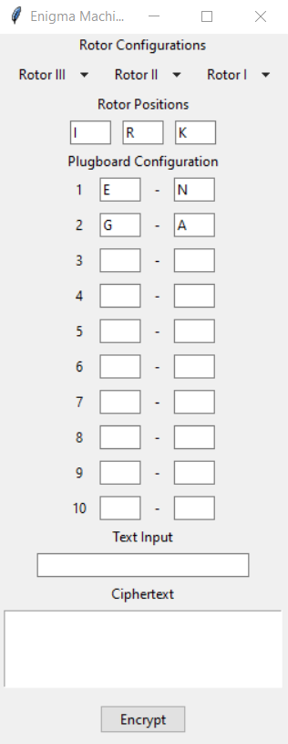
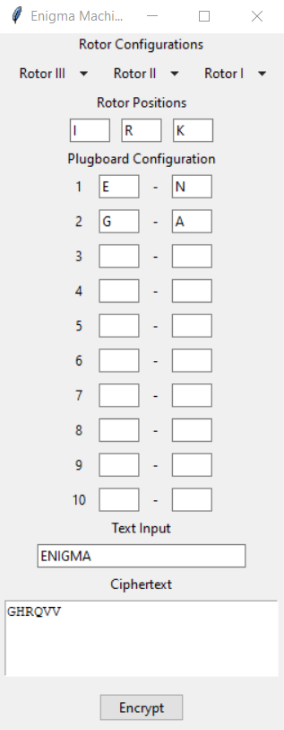

# Enigma Machine Simulator🎲
>Tugas Seleksi IRK
## Table of Contents
* [Contributors](#contributors)
* [General Information](#general-information)
* [Local Setup](#local-setup)
* [File Input Structure](#file-input-structure)
## Contributors
| NIM | Nama |
| :---: | :---: |
| 13521021 | Bernardus Willson  |
## General Information 
The Enigma machine was an encryption device used during World War II by the German military and intelligence agencies. Invented by Arthur Scherbius, it consisted of rotating wheels, or rotors, with electrical contacts that encoded messages. The encryption process involved pressing keys on the keyboard, which sent electrical signals through the rotors, producing encrypted output letters on the display panel. The Enigma machine's complexity and constantly changing encryption patterns made it a formidable challenge to crack.
## Local Setup
<br>
1. Clone this repo using the command below: 

```
git clone https://github.com/bernarduswillson/Enigma.git
```
<br>
2. Run the program directly in this root directory

```
python src/main.py
```
Alternatively, you can use the `run.bat` if you're using Windows. You can open the runner by double clicking it directly or by calling the runner using this command below in the root directory
```
./run.bat
```


<br>
3. You can do several configurations in the configuration section before you encrypt or decrypt a text. You can change the number of rotors, rotor positions, and plugboard pairs.



<br>
4. You can encrypt or decrypt a text by clicking the 'encrypt' button. The encrypted text will be displayed in the 'ciphertext' section.

